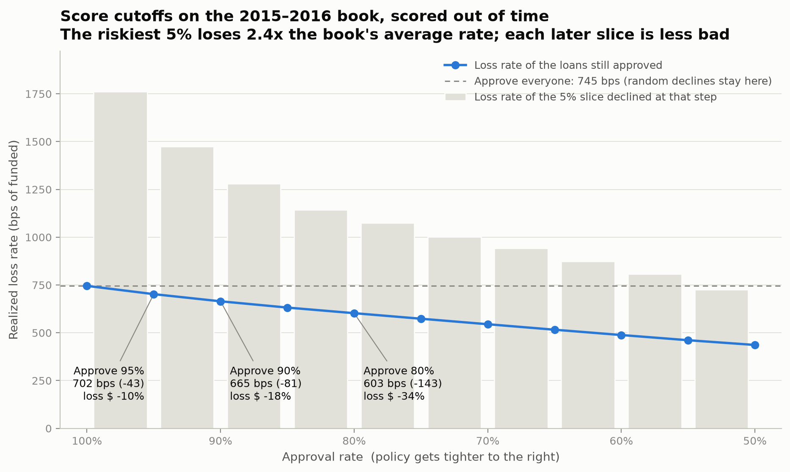

# Portfolio Loss Modeling — LendingClub

**A risk analyst's loss study on 2.26 million real consumer loans: vintage curves, a
default-probability model, a portfolio tail view, and a credit policy simulator.**

Credit risk and catastrophe risk apply the same analysis to different exposures:
take a portfolio of correlated risks, model the distribution of loss, and reason
about the tail. The vocabulary diverges (a credit team says *vintage curve* where a
reinsurance team says *loss development triangle*, *expected loss* where an ILS
investor says *AAL*, *loss distribution* where a cat modeler says *EP curve*) but
the underlying machinery is the same.

This study is built on consumer credit data and framed around portfolio loss, so it
reads as relevant on either side of that bridge.

| Credit concept | Reinsurance / ILS analog | Where it appears |
|---|---|---|
| Vintage curve | Loss development triangle | [Notebook 02](notebooks/02_vintage_curves.ipynb) |
| Cumulative charge-off | Ultimate loss ratio | [Notebook 02](notebooks/02_vintage_curves.ipynb) |
| Segmentation by FICO / grade | Risk-based pricing, exposure segmentation | [Notebook 03](notebooks/03_segmentation.ipynb) |
| Frequency × severity | Frequency × severity | [Notebook 03](notebooks/03_segmentation.ipynb) |
| Portfolio expected loss | AAL (average annual loss) | [Notebook 05](notebooks/05_portfolio_tail.ipynb) |
| Loss distribution / tail | EP curve (exceedance probability) | [Notebook 05](notebooks/05_portfolio_tail.ipynb) |
| Unexpected loss | Capital requirement above the technical rate | [Notebook 05](notebooks/05_portfolio_tail.ipynb) |
| Score cutoff and limit assignment | Underwriting appetite and line size | [Notebook 06](notebooks/06_policy_simulator.ipynb) |

**📄 [Read the report](REPORT.md)** — the plain-English narrative, no code required.

---

## Credit Policy Simulator

**Declining the riskiest 5% of applicants and funding the riskiest fifth at 60% of
the amount they asked for would have cut the 2015–2016 book's loss rate from 745 to
666 bps, with 5% fewer approvals and 9.6% less exposure.**

[Notebook 06](notebooks/06_policy_simulator.ipynb) replays the two decisions a lender
actually makes with a score: whether to approve an applicant, and how much to lend
them. It runs both on the out-of-time book from notebook 04, which the model never
saw. A cutoff alone works as a score should. Approving the safest 90% takes the loss
rate from 745 to 665 bps and cuts loss dollars by 18%, and the loss rate falls at
every 5-point step down to a 50% approval rate.



| Policy | Approval rate | Funded share of request, by PD quintile (safest → riskiest) | Exposure | Loss rate | Δ approvals | Δ exposure | Δ loss rate | Δ loss $ | Δ interest net of loss |
|---|---:|---|---:|---:|---:|---:|---:|---:|---:|
| Approve everyone | 100% | 100% across the board | $4,320M | 745 bps | — | — | — | — | — |
| Cutoff only | 90% | 100% across the board | $3,952M | 665 bps | −10% | −8.5% | −81 bps | −18.4% | −3.9% |
| **A. Light (recommended)** | 95% | 100 / 100 / 100 / 100 / 60% | $3,906M | 666 bps | −5% | −9.6% | −79 bps | −19.2% | −5.4% |
| B. Balanced | 90% | 100 / 95 / 85 / 70 / 60% | $3,366M | 616 bps | −10% | −22.1% | −129 bps | −35.6% | −16.7% |
| C. Tight | 80% | 100 / 90 / 75 / 60 / 50% | $2,909M | 555 bps | −20% | −32.7% | −190 bps | −49.8% | −26.3% |

**Policy A matches the loss-rate cut of declining 10% of applicants while declining
only 5%.** The cutoff-only route keeps slightly more margin (interest net of losses
falls 3.9%, against 5.4% for A), but for a lender that is still growing, keeping about
16,700 more customers is worth 1.5 points. B and C cut losses further, but each basis
point of improvement costs about twice as much margin as it does under A.

**The loans a cutoff removes were not losing money.** Even the riskiest 5% paid 1,996
bps of interest against 1,761 bps of realized loss, netting +235 bps, compared with
+640 bps for the whole book. Both figures are before servicing fees and the cost of
funds. A tighter policy trades thin, volatile margin for lower losses; it does not cut
out loss-makers, and the table above shows what that costs.

**How it was measured.**

| | |
|---|---|
| Book | Notebook 04's out-of-time test set: 333,721 loans issued January 2015 – February 2016, FICO 660+ |
| Loans included | Terminal status only (Fully Paid or Charged Off), and the full 36-month term elapsed by the March 2019 snapshot. The 60-month loans from these years had not matured and are excluded. |
| Score | Notebook 04's logistic model, fit on 2007–2014 vintages using origination-time fields only |
| Bad | Charged Off, Default, or "Does not meet the credit policy. Status:Charged Off" (none of the last fall in this window) |
| Realized loss | Funded amount − principal repaid − recoveries, floored at zero. Loss rate is realized loss over funded amount, in bps |
| Exposure | Funded amount |
| Limits | Each PD quintile is funded at a fixed share of the amount requested; loss and interest scale with the smaller balance |

The baseline reproduces notebook 05 exactly (14.88% bad rate, $322.0M of realized loss
on $4.32B). Training and holdout loans share no issue months, and no post-origination
field is a model input.

**Limitations.**

- **No reject inference.** Only booked loans have outcomes, so the simulator sizes
  tightening the policy, not loosening it.
- **Proportional limits.** A capped loan is assumed to default exactly when the full
  loan did. A smaller payment could lower default risk, and some borrowers would turn
  down a smaller offer.
- **One product, one window.** These are 36-month loans from 2015–2016, a period that
  ran worse than the years before it (finding 1 below). The percentages should travel
  better than the dollar amounts.
- **Margin before costs.** "Interest net of loss" ignores servicing fees, the cost of
  funds and acquisition cost, all of which would make the declined loans look worse.

---

## The four findings

**1. LendingClub's credit quality deteriorated steadily from 2013 to 2016, and the
aggregate loss rate hid it.**

Loss at 12 months on book rose from 2.9% (2013 vintage) to 4.7% (2016) on identical
36-month product. The whole-book loss rate — a single 8% number — blends a 5.9%
cohort with one tracking toward 9% and shows no trend at all.


**2. The 2017 "improvement" was mostly a mix shift, not tighter underwriting.**

Decomposing the 0.32-point improvement: 0.19 points came from reweighting the book
toward better FICO bands, only 0.13 from tighter standards within bands. At the
bottom of the score range 2017 was marginally *worse* than 2016. A mix shift is a
volume decision and reverses with the next growth target; tighter underwriting
persists. The aggregate number cannot tell them apart.

**3. Better information beat a better model.** A logistic regression on borrower
attributes reaches 0.657 out-of-time AUC. LightGBM on the same features reaches
0.675. Adding LendingClub's own loan grade to the *logistic* model reaches 0.684 —
better than the boosted model. The interpretable model is the right production
choice, and that is a modeling judgement rather than a limitation.

**4. The portfolio's tail is made entirely of correlation.**

The tail simulation runs on the **2015–2016 holdout book** — 333,721 loans, $4.32B —
rather than the full 732,629. That is deliberate: the loan-level probabilities come
from a model that never saw these vintages, and a loss distribution built on
in-sample fitted probabilities understates its own dispersion, because the model has
already been shown the answers. (See [the reconciliation](#how-the-loan-counts-reconcile) below.)

Simulate those loans defaulting independently and the distribution collapses to a
spike — standard deviation $1.5M on a $322M expected loss. Add a single systematic
factor at the Basel retail correlation and the standard deviation becomes $86.4M,
with a 1-in-100 loss of $558M. Same loans, same expected loss, entirely different
risk.


Diversification does not protect against a common cause. That sentence belongs in a
credit committee and a reinsurance underwriting meeting equally.

---

## The analysis

| Notebook | What it does |
|---|---|
| [`01_data_prep`](notebooks/01_data_prep.ipynb) | 2.26M raw loans → 732,629 resolved, fully seasoned loans. Binary target, explicit leakage screen, dollar loss measurement. |
| [`02_vintage_curves`](notebooks/02_vintage_curves.ipynb) | **The centerpiece.** Cumulative charge-off by months on book, per origination cohort. A loss development triangle in credit clothing. |
| [`03_segmentation`](notebooks/03_segmentation.ipynb) | Loss by FICO band and loan grade, split into frequency and severity. Pricing adequacy. Mix-vs-quality decomposition. |
| [`04_default_model`](notebooks/04_default_model.ipynb) | Logistic regression on origination-time features, interpreted coefficient by coefficient. Out-of-time validation, calibration, decile lift. LightGBM as a benchmark. |
| [`05_portfolio_tail`](notebooks/05_portfolio_tail.ipynb) | Portfolio expected loss, Vasicek single-factor simulation, EP curve, return-period table, correlation sensitivity. |
| [`06_policy_simulator`](notebooks/06_policy_simulator.ipynb) | Score cutoffs and risk-based limits replayed on the out-of-time book: approval, exposure and loss tradeoffs, and a recommended policy. |

### How the loan counts reconcile

Different sections quote different loan counts. Every step is a deliberate filter,
and they add up exactly:

| Stage | Loans | Why the count changes |
|---|---:|---|
| Raw file | 2,260,701 | — |
| Resolved outcome only | 1,345,350 | Current / Late / In Grace Period have no outcome, so no label |
| Fully seasoned | **732,629** | Full contractual term elapsed before the March 2019 snapshot |
| ↳ minus sub-660 FICO | 732,627 | 2 policy exceptions; a segment built on two loans is noise |
| ↳ **train** — vintages ≤ 2014 | 398,906 | Where the default model is *fit* |
| ↳ **holdout** — vintages 2015–2016 | **333,721** | Where the model is *scored* — and the book notebook 05 simulates |

`398,906 + 333,721 = 732,627`. The split is by origination year rather than at
random, because the job is to underwrite loans that have not been written yet — see
notebook 04.

### On leakage

The single most common error in credit-modeling writeups is predicting default from
evidence of default. This dataset makes it easy to commit: `debt_settlement_flag` is
`Y` for borrowers who negotiated a settlement — which happens *after* they stop
paying — and implies charge-off 100% of the time. Feed it to a model and you get a
0.99 AUC that means nothing.

Notebook 01 excludes 38 post-origination columns in three named groups (payment
performance, post-funding credit refresh, distress flags) and says why for each. The
model sees only what an underwriter could have seen on the day the loan was funded.

---

## Running it

```bash
git clone <this repo>
cd portfolio-loss-modeling
pip install -r requirements.txt

# Download the raw data (~1.7 GB) -- see data/README.md for details
mkdir -p data/raw
curl -L -o data/raw/accepted_2007_to_2018Q4.csv \
  "https://huggingface.co/datasets/codesignal/lending-club-loan-accepted/resolve/main/accepted_2007_to_2018Q4.csv"

jupyter lab notebooks/
```

Run the notebooks in order. `01` does the one slow pass over the raw CSV (~40
seconds) and writes two Parquet tables that everything downstream reads. Notebooks
02–06 each run in well under a minute. Every notebook runs top to bottom without
manual intervention, and the figures in this README are regenerated by running them.

**Stack:** pandas, scikit-learn, statsmodels, matplotlib, LightGBM. Nothing exotic —
every technique here can be explained in a sentence.

```
portfolio-loss-modeling/
├── README.md              # you are here
├── REPORT.md              # the written narrative
├── requirements.txt
├── data/
│   └── README.md          # where to download the dataset (raw data is not committed)
├── notebooks/
│   ├── 01_data_prep.ipynb
│   ├── 02_vintage_curves.ipynb
│   ├── 03_segmentation.ipynb
│   ├── 04_default_model.ipynb
│   ├── 05_portfolio_tail.ipynb
│   └── 06_policy_simulator.ipynb
├── src/
│   ├── data_prep.py       # cleaning, target definition, leakage lists, triangle builder
│   ├── policy.py          # cutoff sweep, limit schedules, policy evaluation
│   └── plotting.py        # palette and chart helpers
└── figures/               # exported charts
```

`.py` copies of each notebook sit alongside the `.ipynb` files (paired via
[jupytext](https://jupytext.readthedocs.io/)) so the diffs are readable in review.

---

## Data

**LendingClub accepted loans, 2007–2018Q4** — 2,260,701 loans, 151 columns,
performance observed through March 2019. Public dataset; the raw file is not
committed. See [`data/README.md`](data/README.md) for the download link and the
directory layout.

## Scope

Deliberately excluded, and worth saying so: no deep learning, no stacked ensembles,
no feature that cannot be explained in one sentence. The point of this study is a
loss model whose every choice is defensible out loud — not a leaderboard score.

## Next steps

The four things this study does not do, in order of priority:

1. **Stress the tail against a downturn.** The correlation is calibrated on
   2012–2015 — a window with no recession in it. Overlaying the 2007–2009 experience
   would replace an extrapolation with a scenario.
2. **Model LGD instead of holding it at 52%.** Severity is stable enough to fix
   across the whole book, but it runs 45% to 66% across the grade scale — so a
   grade- and term-conditional LGD would sharpen expected loss where it is worst.
3. **Make PD macro-conditional.** The model under-predicts out of time by 12%; a
   time-varying intercept would explain that structurally rather than patching it
   with a recalibration scalar.
4. **Give the 60-month book its own triangle.** It is excluded here to keep the
   vintage curves comparable, and it is the structurally riskier half.

---

## License

Released under the MIT License — see [LICENSE](LICENSE).
