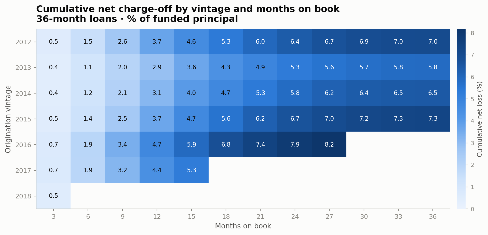
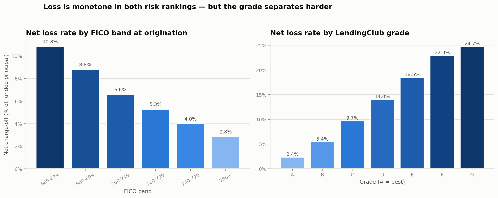
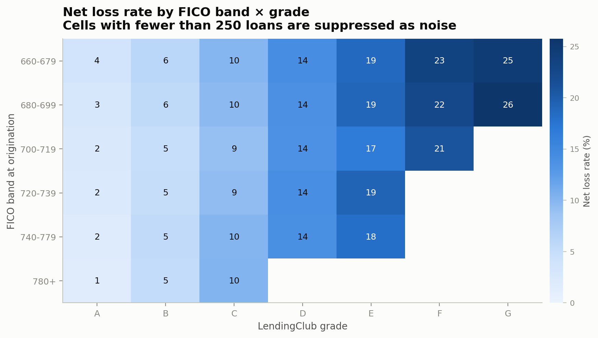
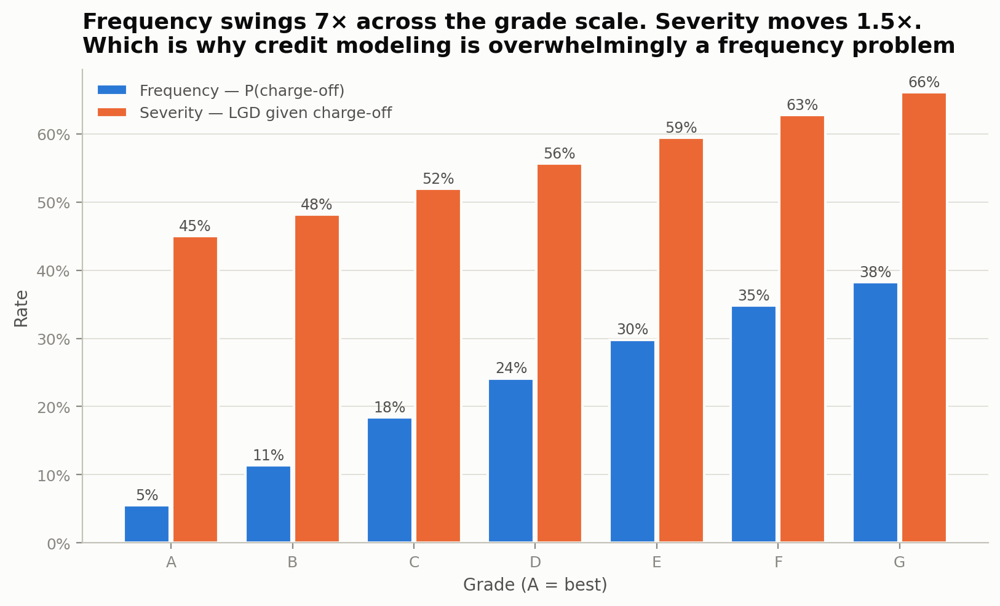
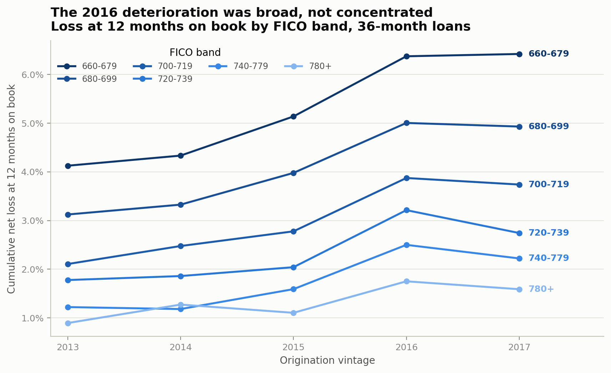
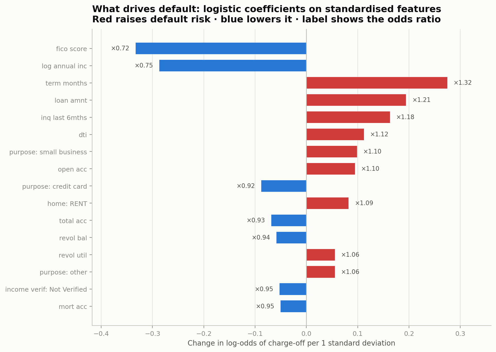
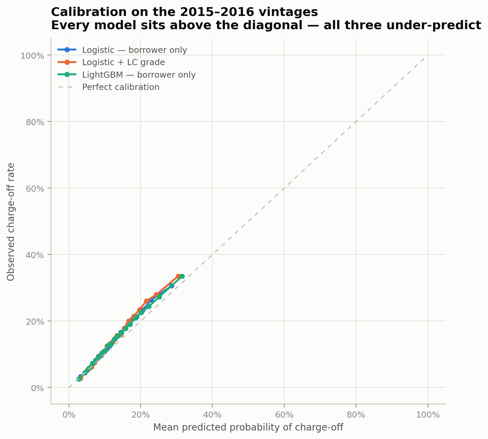
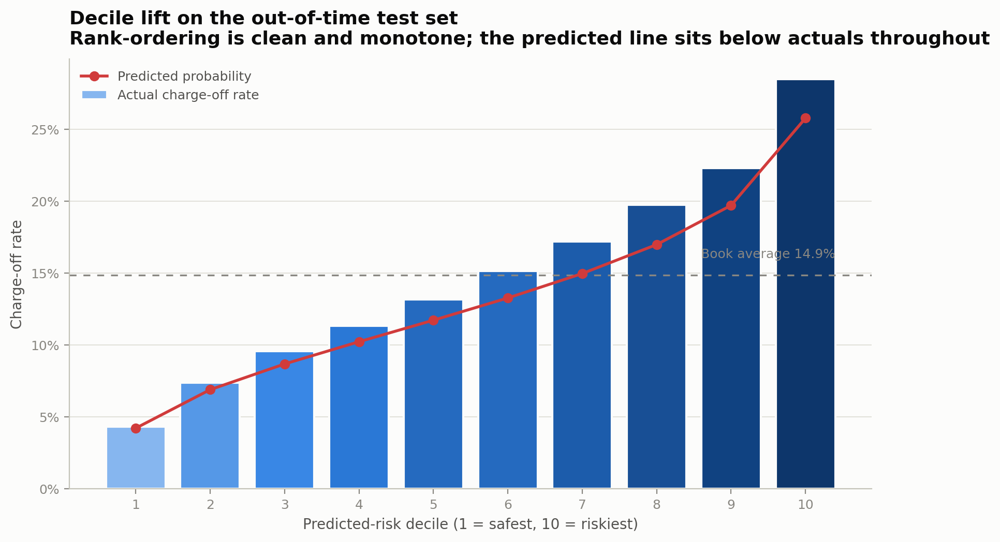
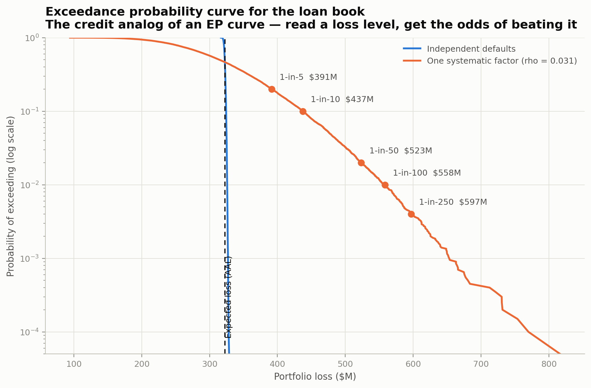
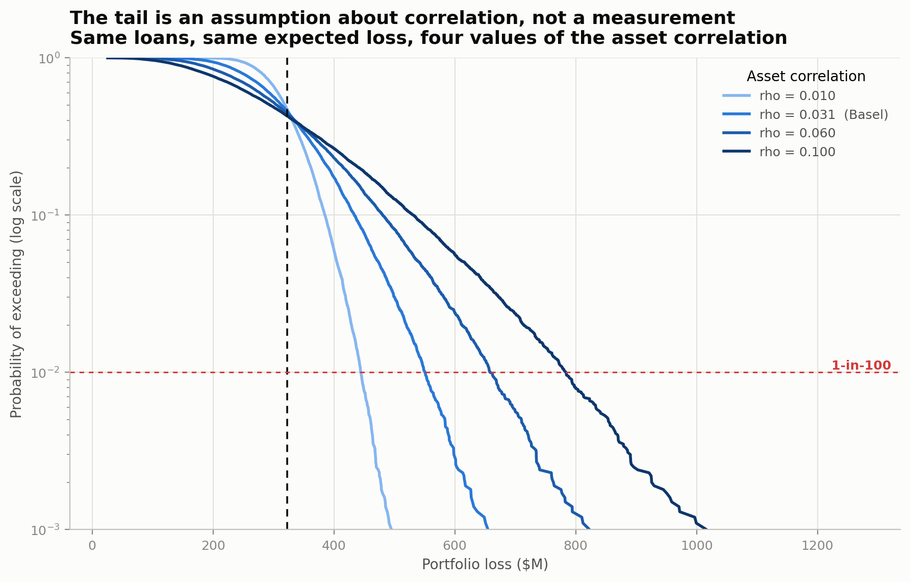

# Portfolio Loss Modeling on 2.26 Million Consumer Loans

*A written summary of the analysis in this repository. No code required.*

---

## Why this study is shaped the way it is

Take a portfolio of correlated risks, model the distribution of loss it can
produce, then reason about the tail and decide what to charge and what to hold
against it.

That description fits a consumer loan book and a property catastrophe treaty
equally well. The vocabulary is what diverges: a credit team's **vintage curve** is a
reinsurance team's **loss development triangle**; **expected loss** on a book is an
ILS investor's **AAL**; a **loss distribution** becomes an **EP curve** when you plot
it upside down. The underlying machinery is the same.

This study runs that machinery end to end on real loan-level data — 2.26 million
LendingClub loans originated between 2007 and 2018 — and is framed around portfolio
loss throughout rather than around classification accuracy. It answers four
questions in order: **when** does loss emerge, **where** does it sit, **what**
predicts it, and **how bad can the whole book get**.

---

## 1. The data, and the one screen that matters

LendingClub published loan-level performance for every loan it originated: 2,260,701
records, 151 columns, with performance observed through March 2019. The target is
binary — did the lender write the loan off, or did the borrower repay in full.

Getting to an honest modeling table means discarding most of the file.

**Loans still paying were removed.** A loan that is "Current" has no outcome yet, so
it cannot carry a label. **Immature cohorts were removed too**, which is the less
obvious filter and the more important one: a loan only enters the study once its
full contractual term has elapsed. A 36-month loan issued in mid-2017 that currently
reads "Fully Paid" is a real observation, but its cohort is still developing and that
cohort's eventual defaults are disproportionately still sitting in "Current" and
"Late." Keeping the resolved ones and dropping the rest is a survivorship filter that
biases measured loss *downward*. This is the same discipline as a reserving cut-off —
you do not book an accident year at ultimate before it has developed.

That leaves **732,629 fully seasoned, resolved loans carrying $9.67 billion of funded
principal**, of which 14.9% charged off and 8.0% of principal was lost net of
recoveries.

**Then the leakage screen.** The published file is a record of each loan's whole
life, not a snapshot of underwriting, so information about the future is scattered
through it. Thirty-eight columns were excluded in three named groups:

- **Payment performance** — how much was actually repaid, recoveries, last payment
  date. This is the answer, not a predictor.
- **Post-funding credit refresh** — the borrower's FICO score *today*, which for a
  defaulted borrower has usually already collapsed.
- **Distress flags** — hardship plans, settlement flags. These fields exist only
  *because* a loan went bad.

How badly does this matter? `debt_settlement_flag` is set for borrowers who
negotiated a settlement, which happens after they stop paying. In the raw file it
implies charge-off **100% of the time**. A model handed that column reports a near
perfect AUC and has learned nothing about credit. Excluding these fields, and
documenting which ones and why, is what keeps this an honest loss study.

One deliberate asymmetry: repayment and recovery amounts are *forbidden as
predictors* and *required to measure the outcome*. A column can serve both roles,
and keeping that distinction straight is what lets the study report dollar losses
rather than classification labels.

---

## 2. Vintage curves: what the headline number hides

Group loans by the year they were originated, then track cumulative loss against
**months on book** rather than calendar date. Every cohort is now compared at the
same age, and the shape of underwriting change becomes visible.

Read as a triangle — cohorts down the side, development age across the top, blank
lower-right where the future has not happened yet — this is structurally identical to
a paid-loss development triangle.

**The findings:**

- **2013 was the best book LendingClub wrote**, finishing at 5.9% cumulative net loss
  at 36 months and sitting lowest at every development age.
- **Credit loosened steadily from 2013 to 2016.** Loss at 12 months on book climbed
  2.9% → 3.1% → 3.7% → 4.7% across the 2013–2016 vintages. Same product, same age,
  progressively more loss. Funded volume roughly doubled between 2013 and 2015 and
  doubled again by 2016; growth and deterioration arrived together, which is the
  usual pattern and the usual warning.
- **2016 is the worst cohort on the board.** At 24 months it had lost 7.9% of
  principal — more than the *fully developed* 36-month loss of the 2013 and 2014
  vintages.

**Why this matters more than a headline loss rate.** The whole-portfolio net loss
rate is 8.0%. That single number blends a 5.9% cohort with one tracking toward 9%,
and it says nothing about direction. The triangle does. This is exactly why reserving
is done by accident year rather than on the aggregate paid number: the average hides
the trend, and the trend is the decision.

---

## 3. Where the loss sits — and the mix-versus-quality question

Splitting the book by FICO band and by LendingClub's own loan grade gives the credit
version of a rate table.

Net loss runs from 2.8% in the 780+ FICO band to 10.8% in 660–679; from 2.4% in grade
A to 24.7% in grade G. Both rankings are monotone, but **the grade separates far
harder than the score** — and the two-way view explains why.

Read **across a row**: hold FICO fixed and loss still climbs steeply with grade — a
700–719 borrower graded A loses 2%, the same borrower graded E loses 17%. Read **down
a column**: hold grade fixed and FICO does almost nothing. Grade C is 9–10% at every
score band.

The grade is not a repackaged FICO score. It carries independent information — DTI,
income verification, utilisation, inquiries — that no single bureau variable
reproduces.

**Frequency and severity are not the same size of problem.**

Across the grade scale, the probability of default swings **7×** (5.5% to 38%) while
loss given default moves **1.5×** (45% to 66%). Both rise with risk, but only one of
them is the variable term. That asymmetry is the structural fact behind everything
that follows: unsecured consumer credit is a **frequency** problem, and modeling
effort belongs there rather than in recovery and workout.

It is also a genuine difference from the catastrophe side. A property cat book is the
mirror image — low, lumpy frequency and enormously variable severity, with the whole
tail living in the severity term. The methods carry over, but the shape of the risk
is different.

**Does the price cover the loss?** Converting the annual coupon and cumulative loss
onto a common footing, gross spread stays positive at every grade and *widens* as
credit worsens — the shape of a rate table doing its job. Two caveats belong with
that: gross spread still has to pay servicing, funding and the cost of capital, and
the wider spread at the bottom comes with far more loss volatility. Whether that is a
good trade is a capital question, which is section 5.

**The mix question.** Every FICO band deteriorated into 2016 — and the *prime* bands
deteriorated proportionally more (740–779 doubled; 660–679 rose 55%). That rules out
a mix shift as the explanation: the credit quality of a 740-FICO borrower genuinely
got worse at the same score.

The 2017 vintage then looked better in aggregate — 4.42% at 12 months versus 4.74%.
Decomposing that 0.32-point improvement the way a loss-ratio movement gets split into
rate and mix:

| Effect | Contribution |
|---|---|
| **Mix** — reweighting toward better FICO bands | −0.19 pts (60%) |
| **Within-band** — genuinely tighter standards | −0.13 pts (40%) |

**Most of the 2017 improvement was a volume decision, not an underwriting one.**
LendingClub shifted the book toward better credit — the 660–679 band fell from 32% to
29% of principal while the 740+ bands grew from 11% to 15%. Within-band standards
improved only modestly, and at the bottom of the score range 2017 was marginally
*worse* than 2016. A mix shift reverses with the next growth target; tighter
underwriting persists. Reading the aggregate alone, you would have called this a
credit turnaround.

---

## 4. The default model — and what interpretability actually costs

A logistic regression on origination-time borrower features, validated **out of
time**: trained on vintages through 2014, tested on 2015–2016. Not a random split —
the job is to underwrite loans that have not been written yet, and the test cohorts
are ones we already know were worse.

Because the inputs are standardised, each coefficient reads as "what happens to
default odds if this feature moves one standard deviation." Six effects dominate, and
every one is something a human underwriter would recognise:

- **FICO is the strongest single feature** — one standard deviation (~32 points of
  score) cuts default odds by 28%.
- **Income lowers risk almost as much as FICO does.** Capacity to pay is nearly as
  informative as credit history.
- **Term is the strongest risk-*increasing* feature.** Sixty months rather than
  thirty-six raises default odds 32% per standard deviation — part genuine duration
  risk, part selection, since borrowers who need the smaller payment are more
  stretched to begin with.
- **Loan size, recent credit inquiries and DTI all raise risk**, in that order.
- **Stated purpose carries real signal.** Relative to debt consolidation,
  small-business borrowing is riskier and credit-card refinancing is safer — a
  borrower consolidating card debt at a lower rate is doing something economically
  sensible; someone funding a business with unsecured personal credit is taking
  business risk onto a consumer balance sheet.

Every coefficient has a sensible sign and a plain-English reading. That is what an
interpretable model buys, and it is what a model-risk review and a fair-lending
adverse-action requirement both need.

### The benchmark

| Model | Out-of-time AUC | KS |
|---|---|---|
| Logistic — borrower features | 0.657 | 0.226 |
| **LightGBM — same features** | **0.675** | 0.252 |
| **Logistic + LendingClub grade** | **0.684** | 0.270 |

Gradient boosting beats the logistic model by 0.018 AUC. That is a real gap, not a
rounding error — but it is small in the terms that matter, since it moves few loans
across any threshold a lender would actually set, and it costs readable coefficients,
direct reason codes and a straightforward model-risk review.

**The sharper result is the third row.** Adding the lender's own grade to the
*logistic* model beats the boosted model on borrower features alone. Better
information beat a better functional form — the usual answer in credit, and the
reason underwriting teams spend their budget on data rather than on architecture.

### The most instructive result: the model under-predicts

On the out-of-time test the model predicts a 13.3% default rate against 14.9%
actual — **12% too low in relative terms**.

This is the deterioration from section 2 reappearing in the model, not a bug. The
2015–2016 vintages were genuinely worse than the 2007–2014 book at the same
observable characteristics, and nothing in the feature set could have said so.

This is why credit models in production are **recalibrated frequently and refit
rarely**. Rank-ordering is stable and transfers out of time — the decile lift table is
cleanly monotone with no inversions on cohorts the model never saw. The *level*
drifts with the credit cycle and has to be reset against recent performance. The
reinsurance analogy is exact: the relativities hold, the base rate has moved and needs
trending.

---

## 5. The portfolio view: expected loss, and where the tail comes from

**Which book, and why not all of it.** The portfolio simulated here is the
**2015–2016 holdout** — 333,721 loans, $4.32 billion — not the full 732,629 from
section 1. The loan-level probabilities have to come from a model that never saw
these loans: a loss distribution built on in-sample fitted probabilities is too
narrow, because the model has already been shown the outcomes it is being asked to
predict. The counts reconcile exactly — 398,906 training loans plus 333,721 holdout
loans is the full 732,627 that survives the sub-660 FICO exclusion.

Aggregating those loan-level probabilities using the standard three-term product
(probability of default × loss given default × exposure), and recalibrating them as
section 4 argued:

**Modeled expected loss: $322.4M (7.46% of exposure). Actual realised net loss:
$322.0M (7.45%).**

That is the AAL, and it is the straightforward part. A point estimate tells you
what to charge; it says nothing about what to hold capital against.

### The tail is made of correlation

Two simulations of the same book, 20,000 scenarios each, with identical expected
loss:

**Independent defaults** — every loan flips its own coin — produce a spike. Standard
deviation $1.5M on a $322M mean. With a book this large the law of large numbers does
its job almost perfectly, and a lender would need essentially no capital.

**One systematic factor** — the Vasicek model underneath the Basel capital formula,
where every borrower's creditworthiness has a common economic component — produces a
standard deviation of $86.4M and a long right tail.

That factor is the event. It is the credit-portfolio equivalent of a hurricane
damaging ten thousand houses on the same afternoon. **Diversification does not
protect against a common cause**, which is why writing more Florida wind does not
diversify a Florida wind portfolio, and why the 2008 mortgage models failed the way
they did.

### The EP curve

| Return period | Portfolio loss | Loss rate | × expected loss |
|---|---|---|---|
| 1-in-5 | $391M | 9.1% | 1.21× |
| 1-in-10 | $437M | 10.1% | 1.36× |
| 1-in-50 | $523M | 12.1% | 1.62× |
| **1-in-100** | **$558M** | **12.9%** | **1.73×** |
| 1-in-250 | $597M | 13.8% | 1.85× |

Expected loss goes into the price. Everything above it, out to a chosen return
period, is **unexpected loss** — what equity is held against, and the number that
decides whether the spread from section 3 is an adequate return. Two treaties with
the same expected loss and different tails are not the same trade, and neither are
two loan books.

### And the tail is an assumption, so it is shown as one

Moving the asset correlation from 0.01 to 0.10 lifts the 1-in-100 from 1.4× expected
loss to 2.4× — a 76% increase in the capital number — while **expected loss does not
move at all**. A pricing model and a capital model can agree completely on the mean
and disagree by a factor of two on the thing that matters.

Checked against reality, the model is about three times more dispersed than the four
observed vintage outcomes (27% coefficient of variation versus 10% realised). Both
sides of that gap are informative: the Basel correlation is a *deliberately
conservative* regulatory parameter, and four cohorts from 2012–2015 is a benign, tiny
sample — **the window does not contain 2008**. Neither figure is a measurement of the
tail. The realised dispersion is a floor built from a calm period; the regulatory
figure is a prudent ceiling; the honest way to narrow the gap is to stress the book
against a downturn rather than trust either number. A cat modeler with a short
historical event set faces exactly this problem and does exactly this.

---

## 6. What I'd do next

Four things this study does not do, in the order I'd tackle them:

1. **Stress the tail against a downturn.** The correlation is calibrated on a window
   containing no recession, so the 1-in-100 is an extrapolation from calm weather.
   Overlaying the 2007–2009 experience — or a macro scenario — would replace it with
   something defensible.
2. **Model loss given default rather than fixing it at 52%.** Severity is stable
   enough to hold constant across the book, which is what justifies the shortcut
   here, but it runs 45% in grade A to 66% in grade G. A grade- and term-conditional
   LGD would sharpen expected loss exactly where the book is worst, and it is the
   step that moves this from a frequency model to a full expected-loss model.
3. **Make the default probability macro-conditional.** The model under-predicts out
   of time by 12%, and section 4 patches that with a single recalibration scalar. A
   time-varying intercept, or unemployment as a cohort-level covariate, would explain
   the drift structurally instead of absorbing it.
4. **Build the 60-month book its own triangle.** It is held out of the vintage curves
   deliberately, to keep loss timing comparable — but it is the structurally riskier
   half of the portfolio and it deserves the analysis rather than the exclusion.

The first two matter most. Everything in section 5 above the mean is an assumption
about correlation, and everything below it assumes severity is a constant.

## What this demonstrates

Real loan-level data, cleaned with an explicit leakage screen; loss measured in
dollars and developed by cohort; a default model whose every coefficient can be
explained in plain language, honestly validated out of time and honestly reported
as miscalibrated; and a portfolio loss distribution whose tail is traced to its
actual source and stress-tested against the assumption driving it.

The techniques are the ones a credit risk team uses daily. They are also, under
different names, the ones a catastrophe and ILS team uses daily — vintage curves are
development triangles, expected loss is AAL, the loss distribution is an EP curve, and
the tail in both comes from correlation rather than from the risk of any single
exposure.

---

*Analysis and code: [`notebooks/`](notebooks/). Data source and download instructions:
[`data/README.md`](data/README.md).*
